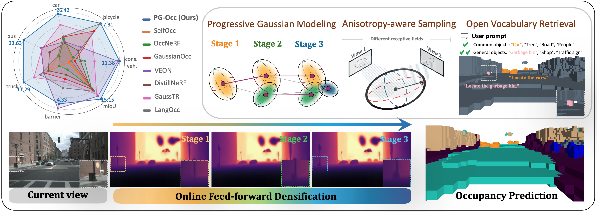
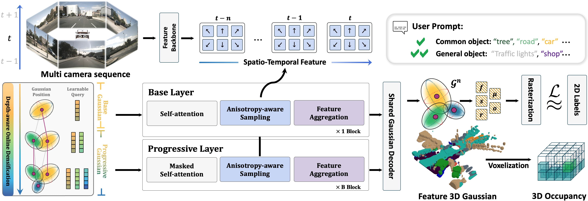

<div align="center">

<!-- <h1 align="center">
  <span style="background: linear-gradient(90deg, #FFB74D, #4CAF50, #2196F3); -webkit-background-clip: text; color: transparent; display: inline-block;">PG-Occ</span>
</h1> -->

</img>

[Chi Yan](https://yanchi-3dv.github.io)<sup>1,2</sup>, [Dan Xu](https://www.danxurgb.net/)<sup>1</sup><br>
<sup>1</sup>The Hong Kong University of Science and Technology, <sup>2</sup>ZEEKR

<!-- <a href='https://arxiv.org/abs/2510.10712'></a> &nbsp;  -->
<a href='https://yanchi-3dv.github.io/PG-Occ/'></a>  &nbsp;
</div>

</img>

Demo videos are available at the [project page](https://yanchi-3dv.github.io/PG-Occ/).

## 📌 TODO
We are organizing the code and applying to the company, please be patient
- [x] Release project page
- [ ] Release model on huggingface
- [ ] Release training code

## 🔆 Abstract

> The 3D occupancy prediction task has witnessed remarkable progress in recent years, playing a crucial role in vision-based autonomous driving systems. While traditional methods are limited to fixed semantic categories, recent approaches have moved towards predicting text-aligned features to enable open-vocabulary text queries in real-world scenes. However, there exists a trade-off in text-aligned scene modeling: sparse Gaussian representation struggles to capture small objects in the scene, while dense representation incurs significant computational overhead. To address these limitations, we present PG-Occ, an innovative Progressive Gaussian Transformer Framework that enables open-vocabulary 3D occupancy prediction. Our framework employs progressive online densification, a feed-forward strategy that gradually enhances the 3D Gaussian representation to capture fine-grained scene details. By iteratively enhancing the representation, the framework achieves increasingly precise and detailed scene understanding. Another key contribution is the introduction of an anisotropy-aware sampling strategy with spatio-temporal fusion, which adaptively assigns receptive fields to Gaussians at different scales and stages, enabling more effective feature aggregation and richer scene information capture. Through extensive evaluations, we demonstrate that PG-Occ achieves state-of-the-art performance with a relative 14.3% mIoU improvement over the previous best performing method.

## 😉 Pipline



## 📭Citation

If you find PG-Occ helpful to your research, please cite our paper:
```
@article{yan2025pgocc,
  title={Progressive Gaussian Transformer with Anisotropy-aware Sampling for Open Vocabulary Occupancy Prediction},
  author={Yan, Chi and Xu, Dan},
  journal={arXiv preprint arXiv:2510.xxxxx},
  year={2025}
}
```
